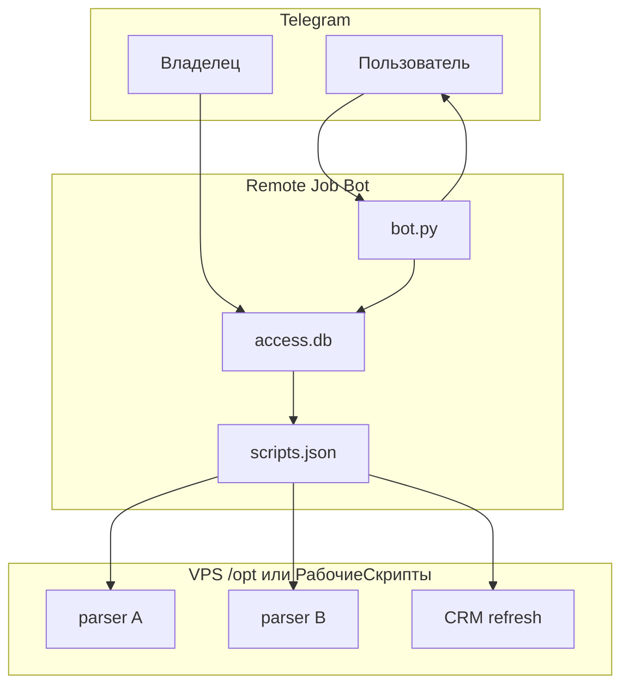
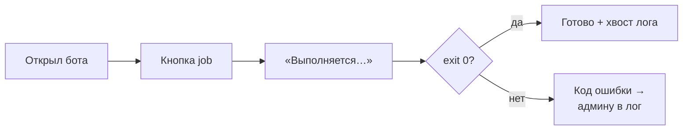
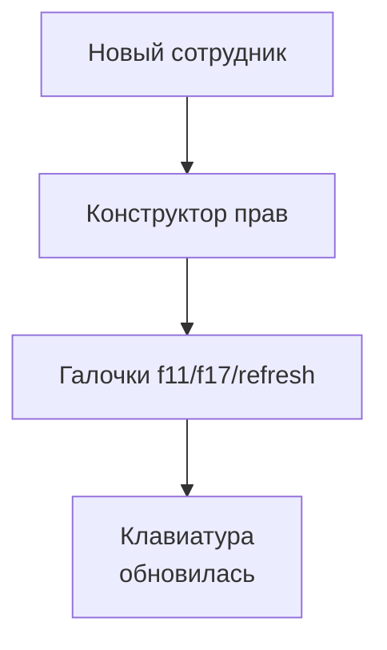

# Remote Job Bot — пульт скриптов на VPS

Короче: **Telegram-кнопки → subprocess на сервере** — без SSH и без выдачи root всем.

Задача: f11, f17, refresh CRM тяжёлые — cron есть, но иногда нужен прогон «сейчас». Не каждый должен лезть в терминал; права — по человеку и по скрипту.

---

## Что сделано

- **Reply-клавиатура** — только разрешённые job для user_id.
- **scripts.json** — реестр: argv, timeout, подсказка cron.
- **access.db** — роли, галочки по скриптам, история run_id.
- **Хвост stdout в чат** — код выхода без полного лога в группу.
- **Конструктор прав** — владелец включает кнопки без правки кода.

---

## Фишки и удобство

| Фишка | Зачем |
|-------|-------|
| Cooldown | Не спамят повторным запуском |
| timeout_sec 7200 | Длинные парсеры не обрываются |
| «Расписание» в меню | Подсказка cron без crontab -e |
| SQLite ACL | Не хардкодить ALLOWED в .py |
| Отдельно от cron | Ручной слой, не замена расписанию |

---

## Схема данных



---

## Процесс пользователя



**Владелец:**



---

## Стек

| Слой | Технология |
|------|------------|
| Бот | python-telegram-bot / aiogram |
| Права | SQLite |
| Запуск | subprocess |
| Конфиг | scripts.json, .env |
| Демон | systemd |

---

## Структура репозитория

```
README.md
LICENSE
.gitignore
bot/bot.py
deploy/server-console-bot.service
docs/                     — DIAGRAMS.md (3× mermaid)
examples/                 — scripts.example.json, .env.example
requirements.txt
```

---

## Быстрый старт

```bash
cp .env.example .env   # BOT_TOKEN, OWNER_ID
cp scripts.json.example scripts.json
systemctl enable --now server-console-bot
```

Добавить job: новая запись в `scripts.json` + права в ACL.
